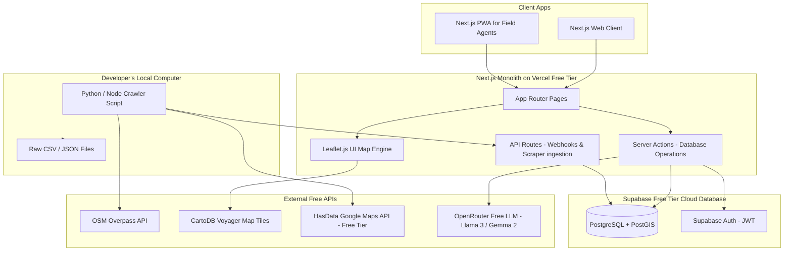
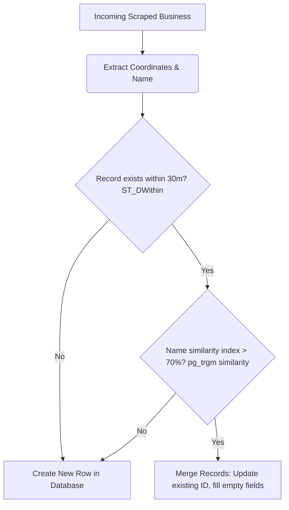
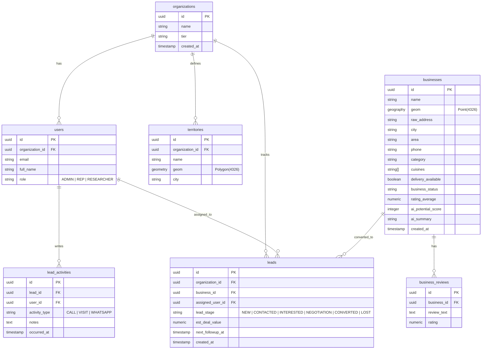
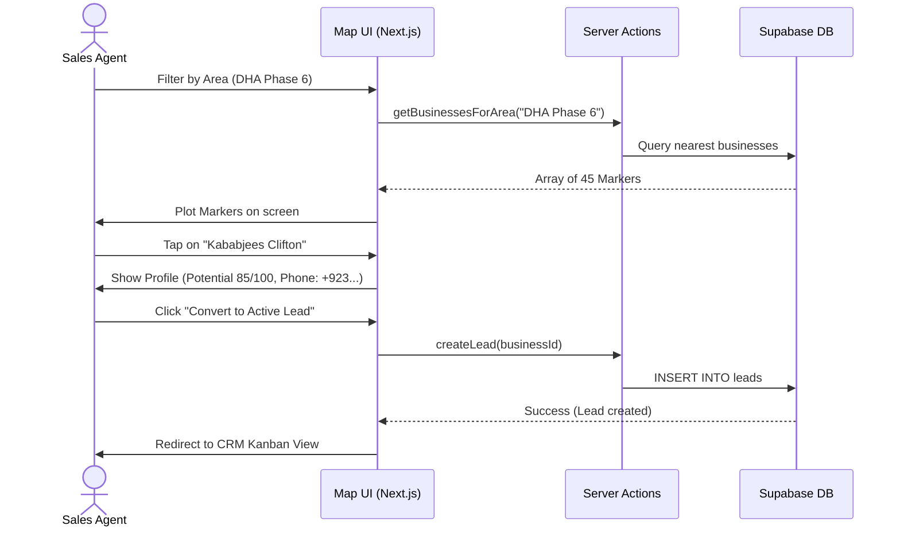

# PakIndex: HORECA Intelligence & Sales Platform
## Master Technical Specification & Implementation Plan (Student & Bootstrapped Edition)

This document is the master technical specification and project blueprint for **PakIndex**, Pakistan's first HORECA (Hotel, Restaurant, Cafe) Intelligence & Sales Platform. Designed for startup development on a student-friendly budget, this plan eliminates high API and cloud infrastructure bills, leveraging open-source mapping libraries, custom data-harvesting workers, and free-tier hosting networks.

---

## Table of Contents
1. **Executive Summary & Target Users**
2. **Core Feature Breakdown (Modules 1–8)**
3. **System Architecture & Data Flow**
4. **Data Acquisition Strategy & Scraping Pipeline**
5. **Database Design (ERD & PostgreSQL/PostGIS DDL)**
6. **API Specification**
7. **Directory & Project Folder Structure**
8. **User Roles & Permissions (RBAC)**
9. **AI Engine & Heuristic Scoring Model**
10. **UI/UX Flow Diagrams**
11. **Infrastructure, Scaling, & Deployment Architecture**
12. **Financial Cost Projections**
13. **Risks and Pakistani Context Mitigation Strategies**
14. **Development & MVP Roadmaps**
15. **Verification & Testing Plan**

---

## 1. Executive Summary & Target Users

### Product Vision
PakIndex provides business intelligence and territory lead management for suppliers selling products to food businesses across Pakistan. By replacing paper sheets and fragmented Excel lists with an interactive geospatial dashboard, PakIndex helps sales teams discover outlets, track communications, allocate territories, and qualify leads.

### User Personas
*   **FMCG / Beverage Distributors**: Sales managers looking to track beverage supply contracts, restaurant conversion progress, and sales agent daily routes.
*   **Packaging / Ingredient Suppliers**: Identifying new restaurant openings and bakeries in high-income neighborhoods (e.g. DHA, Clifton, Johar Town, Gulberg) to pitch packaging solutions.
*   **Sales Representatives (Field Agents)**: Ground agents checking in physically, updating contact info, taking photos, and logging meetings.
*   **Secondary Users**: Research analysts monitoring business birth and death rates in urban commercial corridors.

---

## 2. Core Feature Breakdown

### Module 1: Interactive Restaurant Intelligence Map
*   **Geospatial Visualization**: Displays all food outlets in a geographic region.
*   **Marker Clustering**: Groups close points at low zoom levels to maintain client performance (handling 100,000+ records) and drops clusters to custom markers at high zoom.
*   **Spatial Filters**: Allows search by city, neighborhood (area), category, and rating.
*   **Territory Drawing**: Interactive polygon drawing tool allowing managers to demarcate custom operations boundaries.

### Module 2: Business Profiles
*   **Profile Card**: Standardized display of name, category, primary/secondary phone number, email, website, and social links.
*   **Metadata**: Seating capacity, active opening hours, and delivery status (Foodpanda, direct).
*   **Scoring Visibility**: Score summary showing rating average, classification, and potential score calculation logic.

### Module 3: Advanced Search Engine
*   **Fuzzy Name Matching**: Allows search queries with spelling variations (e.g. "Kababjees" matched with queries for "kababjis").
*   **Faceted Queries**: Combined queries such as `category=Cafe` AND `city=Lahore` AND `potential_score >= 80`.

### Module 4: CRM System
*   **Kanban Board**: Drag-and-drop workflow tracking leads from `New` -> `Contacted` -> `Interested` -> `Negotiation` -> `Converted` / `Lost`.
*   **Activity Logger**: Log timelines for site visits, calls, and chats.
*   **Dynamic WhatsApp Actions**: Action buttons to launch pre-templated messages directly to restaurant managers via WhatsApp.

### Module 5: Territory Management
*   **Rep Assignments**: Link specific polygon boundaries to designated sales agents.
*   **Coverage Auditing**: Identify geographic blocks containing zero assigned sales agents or high uncontacted lead ratios.

### Module 6: AI Intelligence Engine
*   **Explainable Potential Score**: Auto-generated 0-100 rating indicating product purchasing potential based on location tier, scale, reviews, and activity metrics.
*   **Profile Summarizer**: Processes raw Google Reviews to synthesize text summaries (e.g. "Popular burger spot, high seating capacity, active evening rush").

### Module 7: Alerts & Monitoring
*   **Business Change Logs**: Flag status updates like "Closed" or "New Opening" on the main feed.
*   **Notification Delivery**: Send notifications via in-app dashboard badges or WhatsApp links.

### Module 8: Analytics Dashboard
*   **Aggregated Metrics**: Performance tracking of active leads, conversion rates, and territory coverage metrics.
*   **Visual Charts**: Line charts displaying lead conversion timelines and bar charts showing sales rep activity records.

---

## 3. System Architecture & Data Flow

To eliminate operational costs, we use a single Next.js 15 Monolithic application structure, integrating front-end rendering, Server Action back-end utilities, and API route controllers into one service. This allows the system to run on the **Vercel Free Tier**, talking to a **Supabase Free Tier database**.



---

## 4. Data Acquisition Strategy & Scraping Pipeline

To populate the directory without Google Maps API charges, we use a custom geographic parsing scraper run locally.

### Bypassing Google search limits (The Grid Search Algorithm)
Google Maps and OpenStreetMap queries only yield up to 120 results per search query. To bypass this, we divide urban boundaries into **1km x 1km grids** and query the center coordinates of each grid cell.

```
Karachi Bounding Box
+-------------------------------------------------------------+
| (25.0000, 66.9000)                                          |
|     +--------+--------+--------+--------+                   |
|     | Cell 1 | Cell 2 | Cell 3 | Cell 4 |  (Search Radius)  |
|     | (1km)  |        |        |        |  <- 700m radius ->|
|     +--------+--------+--------+--------+                   |
|     | Cell 5 | Cell 6 | Cell 7 | Cell 8 |                   |
|     |        |        |        |        |                   |
|     +--------+--------+--------+--------+                   |
|                                         (24.7500, 67.2500)  |
+-------------------------------------------------------------+
```

### 1. Generating Search Coordinates (Python Script)
This helper script generates the midpoint query inputs for the scraper.

```python
import math

def generate_search_grid(lat_min, lat_max, lng_min, lng_max, step_km=1.0):
    # 1 degree latitude = 111.0 km
    lat_step = step_km / 111.0
    # 1 degree longitude in Pakistan (latitude ~24.8) = 111.0 * cos(24.8) = 100.8 km
    lng_step = step_km / (111.0 * math.cos(math.radians(24.8607)))
    
    grid = []
    curr_lat = lat_min + (lat_step / 2)
    while curr_lat < lat_max:
        curr_lng = lng_min + (lng_step / 2)
        while curr_lng < lng_max:
            grid.append({
                "lat": round(curr_lat, 5),
                "lng": round(curr_lng, 5),
                "radius": int(step_km * 707) # Circle enclosing 1km square
            })
            curr_lng += lng_step
        curr_lat += lat_step
        
    return grid

# Example: Generate coordinates for Karachi DHA & Clifton
karachi_grid = generate_search_grid(24.7800, 24.8400, 67.0000, 67.0800, step_km=1.0)
print(f"Generated {len(karachi_grid)} coordinate targets.")
```

### 2. Google Maps Scraping via HasData API (Free Tier & Pagination)
For your specific HasData account, the scraping endpoint is a `GET` request. 
*   **Result Volume per Credit**: 
    *   Google Maps returns **20 results per page**.
    *   Each page queried costs **1 credit**.
    *   200 credits = **200 page queries**, yielding up to **4,000 unique restaurant listings** ($200 \times 20$).
*   **Pagination (The `start` Parameter)**:
    *   To get more than 20 results for a single query (Google caps results at 120 total), append the **`start`** parameter (offset):
        *   `start=0` (results 1–20)
        *   `start=20` (results 21–40)
        *   `start=40` (results 41–60), and so on.

```javascript
// HasData Google Maps integration script with pagination (Local Node.js)
const axios = require('axios');

async function scrapeWithHasData(query, coords, startOffset = 0) {
  const url = `https://api.hasdata.com/scrape/google-maps/search`;
  
  try {
    const response = await axios.get(url, {
      params: {
        q: query,
        ll: coords, // E.g. "@24.8682,67.0624,15z"
        start: startOffset // Skips offset rows: 0, 20, 40, etc.
      },
      headers: {
        'x-api-key': process.env.HASDATA_API_KEY,
        'Content-Type': 'application/json'
      }
    });

    const businesses = response.data.localResults || [];
    return businesses.map(biz => ({
      name: biz.title,
      lat: biz.gpsCoordinates?.latitude,
      lng: biz.gpsCoordinates?.longitude,
      raw_address: biz.address,
      phone: biz.phone,
      rating_average: biz.rating,
      rating_count: biz.reviews || 0,
      category: biz.type || "Restaurant",
      website: biz.website,
      business_status: biz.openState ? (biz.openState.includes("Closed") ? "CLOSED" : "ACTIVE") : "ACTIVE"
    }));
  } catch (error) {
    console.error("HasData API request failed:", error.message);
    return [];
  }
}
```


### 2.1. Official Google Maps API Integration (Pooling $200 Free Credits)
Google Maps Platform grants **$200 in free monthly credits** per billing account. For a student team, this credit can be multiplied by pooling API keys from multiple team members. 
*   **Credit Capacity**:
    *   *Geocoding API* ($5.00/1k): Up to **40,000 free requests** per month.
    *   *Place Details API* ($17.00/1k): Up to **11,000 free requests** per month.
    *   *Nearby Search* ($32.00/1k): Up to **6,250 free requests** per month.
*   **Key Rotation Strategy**: Store keys as a comma-separated list in env (`GOOGLE_MAPS_KEYS=key1,key2,key3`). The API client rotates through the keys to distribute requests and prevent any single key from exceeding the $200 limit.

```javascript
// Google Places API Client with Key Rotation (Next.js Server Side)
const axios = require('axios');

const GOOGLE_KEYS = process.env.GOOGLE_MAPS_KEYS ? process.env.GOOGLE_MAPS_KEYS.split(',') : [];
let currentKeyIndex = 0;

function getGoogleApiKey() {
  if (GOOGLE_KEYS.length === 0) return null;
  const key = GOOGLE_KEYS[currentKeyIndex];
  // Round-robin rotation
  currentKeyIndex = (currentKeyIndex + 1) % GOOGLE_KEYS.length;
  return key;
}

async function fetchGooglePlaceDetails(placeId) {
  const apiKey = getGoogleApiKey();
  if (!apiKey) {
    throw new Error("No Google Maps API keys configured.");
  }

  try {
    const response = await axios.get('https://maps.googleapis.com/maps/api/place/details/json', {
      params: {
        place_id: placeId,
        fields: 'name,formatted_phone_number,rating,website,opening_hours,geometry',
        key: apiKey
      }
    });
    
    if (response.data.status !== 'OK') {
      throw new Error(`Google API error: ${response.data.status}`);
    }
    
    return response.data.result;
  } catch (error) {
    console.error("Failed to query official Google Places API:", error.message);
    return null;
  }
}
```

### 3. Data Splitting & Normalization
Unstructured restaurant listings scraped from different sources are normalized through these scripts before uploading to the database.

*   **Address Parser (Python)**: Extracts neighborhood areas (e.g., DHA, Clifton, Johar Town, Gulberg) and standardizes the city mapping.
    ```python
    import re

    def parse_pakistani_address(address_str, default_city="Karachi"):
        # Detect city names
        city = default_city
        for c in ["Karachi", "Lahore", "Islamabad", "Rawalpindi", "Peshawar", "Faisalabad", "Multan"]:
            if re.search(r'\b' + c + r'\b', address_str, re.IGNORECASE):
                city = c
                break
                
        # Neighborhood area boundaries extraction
        areas = [
            "DHA Phase \d+", "Clifton", "Gulshan-e-Iqbal", "Gulistan-e-Johar", 
            "Johar Town", "Gulberg", "F-8", "F-7", "F-6", "G-11", "Bahria Town", 
            "Samanabad", "Model Town", "DHA EME", "Wapda Town", "Saddar"
        ]
        detected_area = "Unknown"
        for area in areas:
            match = re.search(area, address_str, re.IGNORECASE)
            if match:
                detected_area = match.group(0)
                break
                
        return {
            "raw_address": address_str,
            "area": detected_area,
            "city": city
        }
    ```

*   **Phone Formatting (Node.js)**: Normalizes telephone inputs (e.g. `0300-1234567`, `021-35812345`) to international E.164 formats (`+923xxxxxxxxx`).
    ```javascript
    function cleanPhone(raw) {
      if (!raw) return null;
      let num = raw.replace(/\D/g, ''); // strip letters and symbols
      if (num.startsWith('0092')) num = num.slice(4);
      else if (num.startsWith('92')) num = num.slice(2);
      else if (num.startsWith('0')) num = num.slice(1);
      
      // Check if it's a valid mobile or landline length
      if (num.length >= 9 && num.length <= 11) {
        return `+92${num}`;
      }
      return null; // Flag as invalid phone number for manual verification
    }
    ```

*   **Cuisine Standardization**: Splitting restaurant tags into standardized arrays. For example, converting `"Pakistani, Barbeque, Fast Food"` into `['Pakistani', 'BBQ', 'Fast Food']`.

### 4. Entity Resolution & Deduplication (Merges & Overlays)
To prevent creating duplicate records when importing listings from both OSM and HasData, we execute an automated matching algorithm during data ingestion:



---

## 5. Database Design & Schema

### Entity Relationship Diagram (ERD)
The schema implements tenant isolation for leads and territories using `organization_id` filters, while the central `businesses` table is shared as a read-only dictionary for authenticated users.



### PostgreSQL Schema DDL Migration
Save this SQL file inside your Supabase migration folder:

```sql
-- 1. Enable Spatial Database Extensions
CREATE EXTENSION IF NOT EXISTS postgis;
CREATE EXTENSION IF NOT EXISTS pg_trgm;

-- 2. Define Custom Enums
CREATE TYPE user_role AS ENUM ('ADMIN', 'REP', 'RESEARCHER');
CREATE TYPE lead_stage_type AS ENUM ('NEW', 'CONTACTED', 'INTERESTED', 'NEGOTIATION', 'CONVERTED', 'LOST');

-- 3. Core Multi-Tenant Tables
CREATE TABLE public.organizations (
    id UUID PRIMARY KEY DEFAULT gen_random_uuid(),
    name VARCHAR(255) NOT NULL,
    tier VARCHAR(50) DEFAULT 'free',
    created_at TIMESTAMP WITH TIME ZONE DEFAULT CURRENT_TIMESTAMP
);

CREATE TABLE public.users (
    id UUID PRIMARY KEY, -- Connects with Supabase Auth auth.users.id
    organization_id UUID REFERENCES public.organizations(id) ON DELETE CASCADE,
    email VARCHAR(255) UNIQUE NOT NULL,
    full_name VARCHAR(255) NOT NULL,
    role user_role DEFAULT 'REP',
    created_at TIMESTAMP WITH TIME ZONE DEFAULT CURRENT_TIMESTAMP
);

-- 4. Shared HORECA Directory Table
CREATE TABLE public.businesses (
    id UUID PRIMARY KEY DEFAULT gen_random_uuid(),
    name VARCHAR(255) NOT NULL,
    
    -- Geospatial coordinates (uses Geography for meters calculation)
    geom GEOGRAPHY(Point, 4326) NOT NULL,
    
    raw_address TEXT NOT NULL,
    city VARCHAR(100) NOT NULL,
    area VARCHAR(100) NOT NULL,
    phone VARCHAR(50),
    category VARCHAR(100) NOT NULL,
    cuisines VARCHAR(100)[] DEFAULT '{}'::varchar[],
    delivery_available BOOLEAN DEFAULT FALSE,
    business_status VARCHAR(50) DEFAULT 'ACTIVE',
    rating_average NUMERIC(3, 2) DEFAULT 0.00,
    
    -- Heuristic Potential Scoring
    ai_potential_score INTEGER CHECK (ai_potential_score >= 0 AND ai_potential_score <= 100),
    ai_summary TEXT,
    
    created_at TIMESTAMP WITH TIME ZONE DEFAULT CURRENT_TIMESTAMP,
    updated_at TIMESTAMP WITH TIME ZONE DEFAULT CURRENT_TIMESTAMP
);

CREATE TABLE public.business_reviews (
    id UUID PRIMARY KEY DEFAULT gen_random_uuid(),
    business_id UUID REFERENCES public.businesses(id) ON DELETE CASCADE,
    review_text TEXT,
    rating NUMERIC(2, 1),
    created_at TIMESTAMP WITH TIME ZONE DEFAULT CURRENT_TIMESTAMP
);

-- 5. CRM Tables
CREATE TABLE public.leads (
    id UUID PRIMARY KEY DEFAULT gen_random_uuid(),
    organization_id UUID REFERENCES public.organizations(id) ON DELETE CASCADE,
    business_id UUID REFERENCES public.businesses(id) ON DELETE RESTRICT,
    assigned_user_id UUID REFERENCES public.users(id) ON DELETE SET NULL,
    lead_stage lead_stage_type DEFAULT 'NEW',
    est_deal_value NUMERIC(12, 2) DEFAULT 0.00,
    next_followup_at TIMESTAMP WITH TIME ZONE,
    created_at TIMESTAMP WITH TIME ZONE DEFAULT CURRENT_TIMESTAMP,
    updated_at TIMESTAMP WITH TIME ZONE DEFAULT CURRENT_TIMESTAMP,
    CONSTRAINT unique_org_business_lead UNIQUE (organization_id, business_id)
);

CREATE TABLE public.lead_activities (
    id UUID PRIMARY KEY DEFAULT gen_random_uuid(),
    lead_id UUID REFERENCES public.leads(id) ON DELETE CASCADE,
    user_id UUID REFERENCES public.users(id) ON DELETE RESTRICT,
    activity_type VARCHAR(50) NOT NULL, -- 'CALL', 'VISIT', 'WHATSAPP'
    notes TEXT,
    occurred_at TIMESTAMP WITH TIME ZONE DEFAULT CURRENT_TIMESTAMP
);

-- 6. Territory Tables
CREATE TABLE public.territories (
    id UUID PRIMARY KEY DEFAULT gen_random_uuid(),
    organization_id UUID REFERENCES public.organizations(id) ON DELETE CASCADE,
    name VARCHAR(255) NOT NULL,
    
    -- Geometry column to store polygon boundaries
    geom GEOMETRY(Polygon, 4326) NOT NULL,
    
    city VARCHAR(100) NOT NULL,
    created_at TIMESTAMP WITH TIME ZONE DEFAULT CURRENT_TIMESTAMP
);

-- 7. High-Performance Indexing Strategy
CREATE INDEX idx_businesses_geom ON public.businesses USING gist (geom);
CREATE INDEX idx_territories_geom ON public.territories USING gist (geom);
CREATE INDEX idx_businesses_name_trgm ON public.businesses USING gin (name gin_trgm_ops);
CREATE INDEX idx_leads_org_stage ON public.leads (organization_id, lead_stage);

-- 8. Entity Resolution Database-level Merge Procedure
CREATE OR REPLACE FUNCTION resolve_incoming_business(
    p_name VARCHAR,
    p_lat DOUBLE PRECISION,
    p_lng DOUBLE PRECISION,
    p_raw_address TEXT,
    p_city VARCHAR,
    p_area VARCHAR,
    p_phone VARCHAR,
    p_category VARCHAR,
    p_rating NUMERIC
) RETURNS UUID AS $$
DECLARE
    matched_id UUID;
BEGIN
    -- Look for matches within a 30-meter radius using GIST indices
    SELECT id INTO matched_id
    FROM public.businesses
    WHERE 
        ST_DWithin(geom, ST_MakePoint(p_lng, p_lat)::geography, 30)
        AND similarity(name, p_name) > 0.70
    LIMIT 1;

    -- Update matched, otherwise insert new
    IF matched_id IS NOT NULL THEN
        UPDATE public.businesses
        SET 
            phone = COALESCE(businesses.phone, p_phone),
            rating_average = GREATEST(businesses.rating_average, p_rating),
            updated_at = CURRENT_TIMESTAMP
        WHERE id = matched_id;
        RETURN matched_id;
    ELSE
        INSERT INTO public.businesses (
            name, geom, raw_address, city, area, phone, category, rating_average
        ) VALUES (
            p_name, 
            ST_MakePoint(p_lng, p_lat)::geography, 
            p_raw_address, 
            p_city, 
            p_area, 
            p_phone, 
            p_category, 
            p_rating
        ) RETURNING id INTO matched_id;
        RETURN matched_id;
    END IF;
END;
$$ LANGUAGE plpgsql;

-- 9. Row Level Security Policies (CRM Isolation)
ALTER TABLE public.leads ENABLE ROW LEVEL SECURITY;
ALTER TABLE public.territories ENABLE ROW LEVEL SECURITY;

CREATE POLICY leads_tenant_isolation ON public.leads
    FOR ALL USING (organization_id = (SELECT organization_id FROM public.users WHERE id = auth.uid()));

CREATE POLICY territories_tenant_isolation ON public.territories
    FOR ALL USING (organization_id = (SELECT organization_id FROM public.users WHERE id = auth.uid()));
```

---

## 6. API Specification

All endpoints handle JSON bodies and validate authorization tokens using the Supabase JWT payload.

### Endpoint Matrix

#### 1. Fetch Map Locations
*   **Request**: `GET /api/businesses`
*   **Query Params**:
    *   `lat` (numeric) - Current map center latitude.
    *   `lng` (numeric) - Current map center longitude.
    *   `radius` (integer) - Search distance in meters.
*   **Response Payload (`200 OK`)**:
```json
{
  "status": "success",
  "data": [
    {
      "id": "a1b2c3d4-e5f6-7a8b-9c0d-1e2f3a4b5c6d",
      "name": "Kababjees Clifton",
      "category": "Restaurant",
      "rating_average": 4.20,
      "lat": 24.81452,
      "lng": 67.03125,
      "ai_potential_score": 85
    }
  ]
}
```

#### 2. Create CRM Lead
*   **Request**: `POST /api/leads`
*   **Body Payload**:
```json
{
  "business_id": "a1b2c3d4-e5f6-7a8b-9c0d-1e2f3a4b5c6d",
  "assigned_user_id": "99999999-8888-7777-6666-555544443333",
  "est_deal_value": 75000.00
}
```
*   **Response Payload (`210 Created`)**:
```json
{
  "status": "success",
  "lead_id": "5555aaaa-4444-bbbb-2222-cccc1111dddd"
}
```

#### 3. Save Territory Polygon
*   **Request**: `POST /api/territories`
*   **Body Payload**:
```json
{
  "name": "Gulberg Zone A",
  "city": "Lahore",
  "polygon": [
    [74.3412, 31.5123],
    [74.3523, 31.5123],
    [74.3523, 31.5012],
    [74.3412, 31.5012],
    [74.3412, 31.5123]
  ]
}
```
*   **Response Payload (`201 Created`)**:
```json
{
  "status": "success",
  "territory_id": "eeeedddd-cccc-bbbb-aaaa-999988887777"
}
```

---

## 7. Directory & Project Folder Structure

A standardized, unified monorepo framework built to keep code separated cleanly while compiling into a single Vercel deployment unit.

```
pakindex/
├── scraper/                         # Local python data parser scripts
│   ├── coordinates_grid.py          # Grid center coordinate builder
│   ├── playwright_scraper.js        # Gmaps data extractor
│   └── raw_data_dump/               # Storage directory for dev JSON outputs
│
├── src/
│   ├── app/                         # Next.js pages
│   │   ├── layout.tsx
│   │   ├── page.tsx                 # Landing Page
│   │   ├── (auth)/                  # Auth forms
│   │   │   └── login/
│   │   └── (dashboard)/             # Main Dashboard portal routes
│   │       ├── map/                 # Map canvas
│   │       ├── leads/               # Kanban board
│   │       ├── territories/         # Boundaries editor
│   │       └── api/                 # BFF API Server Actions
│   │
│   ├── components/                  # Client React Views
│   │   ├── LeafletMap.tsx           # Geolocation canvas component
│   │   ├── KanbanBoard.tsx          # Drag and drop pipelines view
│   │   └── ui/                      # Base buttons, input boxes
│   │
│   ├── hooks/
│   │   └── useMapState.ts           # Shared state management hook
│   │
│   └── lib/
│       ├── supabase.ts              # DB connection client
│       └── scoring.ts               # Local heuristic calculation logic
│
├── package.json
└── tailwind.config.js
```

---

## 8. User Roles & Permissions Matrix (RBAC)

Enforces role access configurations. Role limits are verified via middleware functions at runtime.

| Action / Capability | Admin (Manager) | Rep (Sales Agent) | Researcher |
| :--- | :---: | :---: | :---: |
| **Import Scraped Data** | Yes | No | Yes |
| **Draw Territories** | Yes | No | No |
| **Assign Leads to Agents** | Yes | No | No |
| **Move Pipeline Stages** | Yes | Yes (Assigned leads) | No |
| **Log Visit Activities** | Yes | Yes | No |
| **Configure System Integration**| Yes | No | No |

---

## 9. AI Engine & Heuristic Scoring Model

To avoid third-party AI processing bills, the priority rating score is computed locally using a heuristic weighted rating equation.

### Formula for Supplier Potential Score
$$\text{Potential Score} = (0.40 \times \text{Location Modifier}) + (0.35 \times \text{Rating Weight}) + (0.25 \times \text{Interaction Weight})$$

1.  **Location Modifier (40 Points)**: Points determined by neighborhood classifications:
    *   *Tier A (DHA, Clifton, Gulberg, F-6)* = 100 points
    *   *Tier B (Johar Town, Gulshan-e-Iqbal)* = 70 points
    *   *Tier C (Dhabas, outer locations)* = 30 points
2.  **Rating Weight (35 Points)**: Derived from the review ranking index:
    *   Rating $\ge 4.3$ with $> 500$ reviews = 100 points
    *   Rating between $3.8 \text{ and } 4.2$ = 70 points
    *   Rating $< 3.8$ = 30 points
3.  **Interaction Weight (25 Points)**: Evaluates presence details (delivery platform presence, website URL present, primary phone valid). Each detail present adds 8 points, up to 25.

### AI Summaries & Insights via OpenRouter Free Tier (OpenAI SDK Compatible)
OpenRouter provides free API access to highly capable models like `meta-llama/llama-3-8b-instruct:free`, `mistralai/mistral-7b-instruct:free`, and `google/gemma-2-9b-it:free`. We connect to OpenRouter using the standard `openai` NPM package, routing calls through Server Actions.

```typescript
// Next.js Server Action using OpenRouter Free Models
import OpenAI from "openai";

const openai = new OpenAI({
  baseURL: "https://openrouter.ai/api/v1",
  apiKey: process.env.OPENROUTER_API_KEY,
  defaultHeaders: {
    "HTTP-Referer": "https://pakindex.com", // Optional, required by OpenRouter
    "X-Title": "PakIndex",
  }
});

export async function generateSummaryWithOpenRouter(reviewsArray: string[]) {
  const reviewsText = reviewsArray.slice(0, 8).join(" | ");
  
  try {
    const completion = await openai.chat.completions.create({
      model: "meta-llama/llama-3-8b-instruct:free", // Free tier model
      messages: [
        {
          role: "system",
          content: "You are a HORECA business analyst in Pakistan. Summarize these reviews into a single paragraph profile analysis for a food supplier."
        },
        {
          role: "user",
          content: `Analyze these reviews: ${reviewsText}`
        }
      ],
      max_tokens: 150
    });

    return completion.choices[0]?.message?.content || "No summary available.";
  } catch (error) {
    console.error("OpenRouter API error:", error);
    return "Summary generation offline.";
  }
}
```

---

## 10. UI/UX Flow Diagrams

### Sales Representative Lead Pipeline Journey


---

## 11. Infrastructure, Scaling, & Deployment Architecture

### Deployment Configurations
*   **Web Application Server**: Hosted on **Vercel** (Hobby/Free Tier). Handles all requests, server rendering, and database calls.
*   **Database Engine**: Deployed on **Supabase** (Free Tier). Provides PostgreSQL database, PostGIS extension, and Auth out of the box.
*   **Storage (Images)**: Saved inside the Supabase Storage Bucket (up to 1GB free storage).

### Performance Optimization for 100,000+ Records
1.  **PostGIS Boundary Limit Box**: When viewing the map, queries are constrained using coordinates boundaries (bounding box).
    ```sql
    SELECT id, name, geom::json FROM public.businesses 
    WHERE geom && ST_MakeEnvelope(lng_min, lat_min, lng_max, lat_max, 4326);
    ```
2.  **Point Cluster Throttling**: The map is built to request and plot coordinates only when the zoom level is $\ge 12$. Zoom levels below 12 display high-level markers for central neighborhoods with aggregate listing numbers.

---

## 12. Financial Cost Projections

| Resource / Tool | Standard Plan | Student / Free-Tier Choice | Monthly Cost |
| :--- | :--- | :--- | :---: |
| **Server Hosting** | AWS ECS (\$150/mo) | **Vercel** (Free Tier) | **\$0** |
| **Database Engine** | RDS Database (\$120/mo) | **Supabase** (Free Tier) | **\$0** |
| **Map Engine & Tiles**| Mapbox APIs (\$400/mo) | **Leaflet.js** + **CartoDB Voyager** | **\$0** |
| **Geospatial Points** | Google Places (\$500/mo) | **OSM** + **HasData Free Tier** | **\$0** |
| **AI Text Engines** | OpenAI API (\$200/mo) | **OpenRouter Free Tier Models**| **\$0** |
| **WhatsApp Messaging**| Twilio (\$150/mo) | **Link generation (wa.me)** | **\$0** |
| **Total Project Cost**| **\$1,520 / month** | **Bootstrapped Version** | **\$0 / month** |

---

## 13. Risks & Pakistani Context Mitigation Strategies

### 1. Unstructured Address Formats
*   *Risk*: Addresses in Pakistan lack structured zip codes (e.g. "Opposite National Bank near Gol Gappay Wala, Gulshan Block 3").
*   *Mitigation*: Use regex matches to extract the neighborhood area (e.g., "Block 3", "Gulshan"). When coordinates are scraped, they are stored directly as the absolute geographical location (`geom` point), bypassing the need to parse raw address descriptions.

### 2. Scraping Limits and IP Blocking
*   *Risk*: Google blocking local scraper IP addresses after repeated requests.
*   *Mitigation*: Implement request rate limits (adding a random delay of 3–8 seconds between searches) and extract baseline coordinate structures from OSM's Overpass API beforehand. Run scraper actions in smaller, isolated batch tasks.

### 3. Spotty Mobile Data in Dense Markets
*   *Risk*: Sales reps losing cellular connections while on the ground inside commercial bazaars.
*   *Mitigation*: Next.js Progressive Web App (PWA) configuration stores active client rosters in local storage (IndexedDB). Completed check-in transactions are saved locally and synced to Supabase when a stable connection is restored.

---

## 14. Development & MVP Roadmaps

The MVP focuses on establishing a functional directory for one pilot city (Karachi) within a 4-week timeline.

```
Week 1: Schema Setup & Base Seeding
├── Deploy database migrations on Supabase.
├── Configure project codebase with Next.js & Tailwind.
└── Run OSM extractor scripts to retrieve baseline coordinate layouts for Karachi.

Week 2: Web Map & Profile Cards
├── Integrate Leaflet map container component.
├── Query database items using coordinates viewport bounding limits.
└── Design UI drawer displaying restaurant profile details.

Week 3: CRM Kanban Pipeline
├── Construct Kanban drag-and-drop workflow component.
├── Connect pipeline update actions with database transactions.
└── Add custom button to launch wa.me/ links for WhatsApp chat integration.

Week 4: Territories drawing & Testing
├── Add polygon drawing tools using Leaflet-Draw.
├── Apply SQL checking query (ST_Contains) to link markers with drawn territories.
└── Seeding checks and deployment to Vercel.
```

---

## 15. Verification & Testing Plan

### 1. Spatial Search Validation Query
Run this test check inside the Supabase SQL Editor to confirm that radius search matches are computed accurately:

```sql
-- Search for restaurants within 800 meters of coordinates in DHA Phase 6
SELECT name, ST_Distance(geom, ST_MakePoint(67.0612, 24.7891)::geography) AS distance
FROM public.businesses
WHERE ST_DWithin(geom, ST_MakePoint(67.0612, 24.7891)::geography, 800)
ORDER BY distance ASC;
```

### 2. Monolithic Application Load Test (k6 Script)
Run a local performance simulation script to check API path responses:

```javascript
import http from 'k6/http';
import { check, sleep } from 'k6';

export const options = {
  vus: 20,
  duration: '10s',
};

export default function () {
  const res = http.get('http://localhost:3000/api/businesses?lat=24.8607&lng=67.0011&radius=1000');
  check(res, {
    'status is 200': (r) => r.status === 200,
    'response speed < 300ms': (r) => r.timings.duration < 300,
  });
  sleep(1);
}
```
